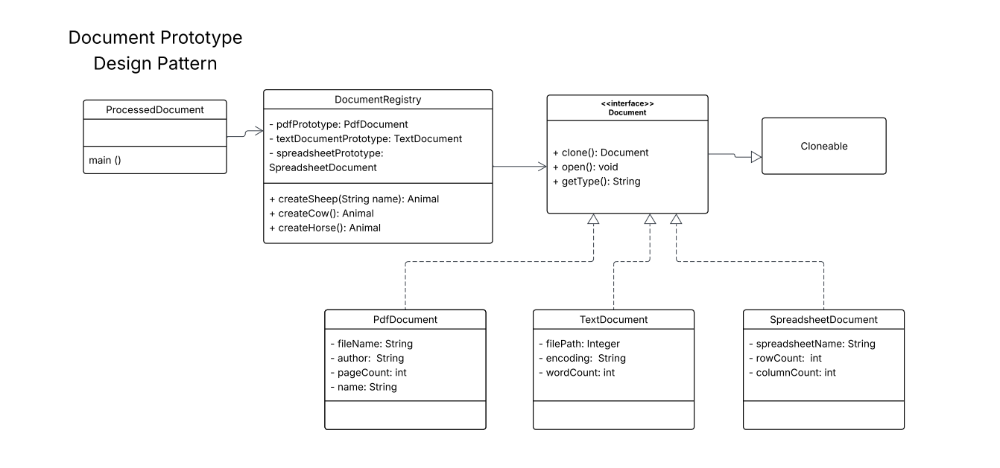

# SoftEng2_LabAssignment7_Prototype
## Problem Description

This activity requires the implementation of a class diagram using the Prototype Design Pattern. Must create prototype instances of `PdfDocument`, `TextDocument`, and `SpreadsheetDocument` and use their `clone()` methods to generate new instances with custom attributes. The application should strictly adhere to the class structure illustrated in the UML and must produce the exact output format provided, showcasing the prototype creation and cloning process in action.

### Expected Output
Creating a PDF Document prototype. //Executed in the constructor  
Creating a Text Document prototype. //Executed in the constructor  
Creating a Spreadsheet Document prototype. ///Executed in the constructor  

Opening PDF Document: annual_report_2024.pdf by Acme Corp (150 pages)  
Type: PDF, File: annual_report_2024.pdf, Author: Acme Corp, Pages: 150  

Opening Text Document: meeting_notes.txt with encoding: UTF-8 (250 words)  
Type: Text, Path: meeting_notes.txt, Encoding: UTF-8, Words: 250  

Opening Spreadsheet Document: sales_data_q1.xlsx (1000 rows, 20 columns)  
Type: Spreadsheet, Name: sales_data_q1.xlsx, Rows: 1000, Columns: 20  

Opening PDF Document: summary_report.pdf by Acme Corp (30 pages)  

## UML Diagram

